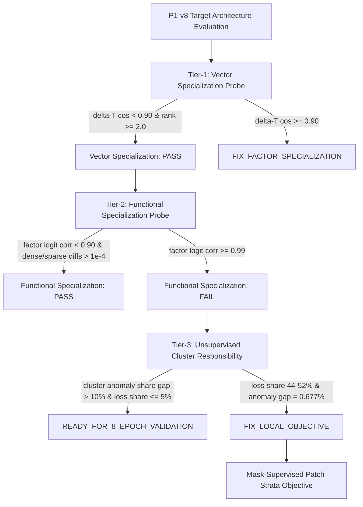

# ACD-CLIP Phase4 P1-v8 Experiment Decision Tree

## Current Decision State
- **State**: `FIX_LOCAL_OBJECTIVE`
- **Status of 8-Epoch / 20-Epoch Gate**: `BLOCKED`

## Decision Matrix Summary

| Milestone | Gate Criteria | Result | Action / Outcome |
| :--- | :--- | :--- | :--- |
| **Metric Parity** | Match baseline evaluation results | `PASS` | Verified |
| **50-Batch Wiring Smoke** | Full backward & forward execution without NaNs | `PASS` | Verified |
| **Tier-1 Vector Diversity** | $\Delta T$ Cosine $< 0.900$, Rank $\ge 2.0$ | `PASS` | $\Delta T$ median cosine $= 0.8930$, rank $= 2.64$ |
| **Tier-2 Functional Diversity** | Factor logit correlation $< 0.900$ | `FAIL` | Logit correlation $= 0.999269$ |
| **Tier-3 Responsibility Calibration** | Loss share $\le 5\%$, Anomaly gap $> 10\%$ | `FAIL` | Loss share $= 44 - 52\%$, Anomaly gap $= 0.677\%$ |
| **Final Decision** | Choose exact next objective | **`FIX_LOCAL_OBJECTIVE`** | Plan mask-supervised strata |
